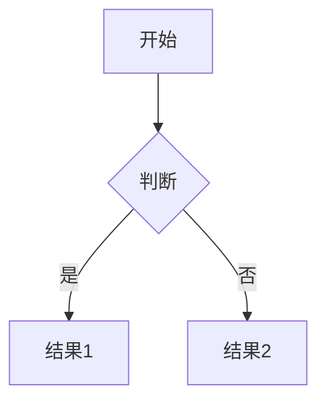
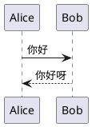

# Markdown 语法大全

> 本笔记整理 Markdown 全部语法，按 基础 → 扩展 → 高级 → 特殊 分类，每条含语法写法、渲染效果与平台兼容性说明。

## 一、基础语法（CommonMark）

### 1. 标题 Heading

六级标题，`#`​ 数量对应级别；行尾可加任意数量 `#` 作为闭合（可选）。

```text
# 一级标题
## 二级标题
### 三级标题
#### 四级标题
##### 五级标题
###### 六级标题
```

**Setext 风格标题**（h1/h2 的另一种写法）：

```text
大标题
======

小标题
------
```

### 2. 段落与换行

- 段落之间用**一个空行**分隔
- 行尾加**两个及以上空格**再回车 → 强制换行（）
- 也可用 HTML 标签 ​ 或反斜杠 `\` 换行

```text
第一段内容。

第二段内容，行尾两个空格  
强制换行
```

### 3. 强调 Emphasis

|语法|效果|说明|
| ------| ------| ------------------------------------|
|`**加粗**`|**加粗**|双星号，推荐|
|`__加粗__`|**加粗**|双下划线|
|`*斜体*`|*斜体*|单星号，推荐|
|`_斜体_`|*斜体*|单下划线|
|`***粗斜体***`|***粗斜体***|三星号|
|`___粗斜体___`|***粗斜体***|三下划线|
|`~~删除线~~`|~~删除线~~|GFM 扩展，常用|
|`==高亮==`|==高亮==|GFM 扩展，部分平台支持（思源支持）|

嵌套规则：`**加粗里含 *斜体***`​ → **加粗里含** ***斜体***

### 4. 行内代码 Inline Code

```text
使用 `printf()` 函数输出内容。
```

使用 `printf()` 函数输出内容。反引号内若需包含反引号，用双反引号包裹。

### 5. 代码块 Code Block

**围栏式（fenced，推荐）** ——三个及以上反引号或波浪号，可标注语言实现高亮：

```python
def hello():
    print("Hello, Markdown!")
```

支持的语言标注示例：`python`​、`javascript`​、`bash`​、`json`​、`html`​、`sql`​、`java`​、`go`​、`rust`​、`c`​、`cpp`​、`markdown`​、`diff`​、`mermaid` 等。

**缩进式（indented）** ——每行缩进 4 个空格或 1 个 Tab（旧式写法）。

**diff 语法高亮**：

```diff
+ 新增行（绿色）
- 删除行（红色）
 上下文行（灰色）
```

### 6. 引用 Blockquote

```text
> 一级引用
>> 二级嵌套引用
>>> 三级嵌套引用
>
> 引用内可包含列表、代码块等：
> - 项目一
> - 项目二
```

渲染效果：

> 一级引用
>
>> 二级嵌套引用
>>
>>> 三级嵌套引用
>>>
>>
>
> 引用内可包含列表、代码块等：
>
> - 项目一
> - 项目二

引用内代码块需额外缩进或用围栏式；引用可与空行 `>` 分段。

### 7. 列表 List

**无序列表**：`-`​、`*`​、`+` 均可，可混用（不推荐）。

```text
- 苹果
- 香蕉
  - 小米蕉（嵌套，缩进 2-4 空格）
    - 三级嵌套
- 樱桃
```

**有序列表**：数字加点 `1.`，数字不必连续，渲染自动递增。

```text
1. 第一步
2. 第二步
   1. 子步骤（缩进嵌套）
3. 第三步
```

**任务列表 Task List**（GFM）：

```text
- [ ] 未完成任务
- [x] 已完成任务
```

渲染效果：

- [ ] 未完成任务
- [X] 已完成任务

**列表内嵌代码块**：缩进 8 空格或围栏式；**列表内嵌段落**：缩进 4 空格。

### 8. 链接 Link

**行内式**：

```text
[百度](https://www.baidu.com)
[带标题的链接](https://www.baidu.com "鼠标悬停提示")
```

**参考式**（文末定义，便于复用）：

```text
[GitHub][gh]
[空标题参考链接][]

[gh]: https://github.com
[]: https://example.com
```

**自动链接**：

```text
<https://www.baidu.com>
<email@example.com>
```

**相对链接**（仓库内文件）：`[说明文档](./docs/readme.md)`

**思源笔记引用**（特殊语法）：块引用 `((块ID "锚文本"))`​、文档引用 `((文档ID "锚文本"))`，用于笔记间跳转。

### 9. 图片 Image

```text


![替代文字][img]

[img]: https://example.com/image.png
```

- 图片语法与链接几乎相同，仅前置 `!`
- 可配合 HTML 标签控制尺寸：``

### 10. 水平线 Horizontal Rule

```text
---
***
___
```

三个及以上 `-`​、`*`​、`_`​ 单独成行（`-` 与标题语法冲突，注意上下文）。

---

### 11. 转义字符 Escape

反斜杠转义以下字符：

```text
\` \* \_ \{ \} \[ \] \< \> \( \) \# \+ \- \. \! \| \\ \~ \$
```

示例：`\# 不是标题` → # 不是标题

### 12. 行内 HTML

```text
这是 <span style="color:red">红色文字</span>
<kbd>Ctrl</kbd> + <kbd>C</kbd>
<sub>下标</sub> / <sup>上标</sup>
```

<div>
这是 <span style="color:red">红色文字</span>，<kbd>Ctrl</kbd>+<kbd>C</kbd>，H<sub>2</sub>O 和 x<sup>2</sup>。
</div>

块级 HTML 标签（`<div>`​、`<table>`​、`<details>` 等）也可直接嵌入，内部内容不再按 Markdown 解析（部分平台例外）。

## 二、扩展语法（GFM / 常见平台）

### 13. 表格 Table

```text
| 左对齐 | 居中 | 右对齐 |
| :--- | :---: | ---: |
| a | b | c |
| 单元格内 **加粗** | `代码` | [链接](https://x.com) |
```

渲染效果：

|左对齐|居中|右对齐|
| :----------| :----: | -------: |
|a|b|c|
|单元格内 **加粗**|`代码`|[链接](https://x.com)|

- 分隔行至少 3 个 `-`；冒号位置决定对齐
- 单元格内可用行内格式；管道符 `|`​ 需转义 `\|`​；可省略首尾 `|`

### 14. 脚注 Footnote

```text
这是一句话[^1]，另一句[^2]。

[^1]: 第一条脚注内容。
[^2]: 第二条脚注，支持多行（缩进）。
```

GFM 平台支持，渲染为文末注释并自动编号。

### 15. 删除线、高亮、上下标

|语法|效果|支持|
| ------| ------| -----------------------|
|`~~删除~~`|~~删除~~|GFM|
|`==高亮==`|==高亮==|部分平台（思源支持）|
|`^上标^`|<sup>上标</sup>|部分平台（GFM 用 ）|
|`~下标~`|<sub>下标</sub>|部分平台（GFM 用 ）|

### 16. Emoji

```text
:smile: :rocket: :+1:
```

GitHub 风格短代码转 emoji；微信/思源等平台可直接输入 emoji 字符。

### 17. 自动识别 URL 与 @ 提及

```text
直接粘贴 https://www.baidu.com 自动成链接
@用户名 提及（GitHub 等平台）
#123 issue/PR 编号（GitHub）
```

## 三、高级语法

### 18. 目录 TOC

```text
[TOC]
```

思源笔记支持 `[TOC]`​ 自动生成文档目录；GitHub 可写 `[TOC]`（部分支持）或手写锚点列表。

### 19. 标题锚点 Anchor

```text
[跳转到「标题」小节](#标题)
[跳转英文锚点](#section-name)
```

GitHub 自动为标题生成锚点（英文小写、空格转 `-`、去符号）；思源内建议直接用块引用跳转。

### 20. 数学公式 Math

**行内公式**：`$...$`

```text
质能方程 $E = mc^2$
```

**块级公式**：`$$...$$`（独立成段居中）

```text
$$
\int_0^\infty e^{-x^2} dx = \frac{\sqrt{\pi}}{2}
$$
```

支持 LaTeX 语法：上标 `^`​、下标 `_`​、分数 `\frac{}{}`​、根号 `\sqrt{}`​、求和 `\sum`​、积分 `\int`​、矩阵 `\begin{matrix}`​、分段函数 `\begin{cases}`​、希腊字母 `\alpha \beta \pi` 等。

### 21. 图表 Mermaid

围栏代码块标注 `mermaid` 语言即可渲染图表：



支持 flowchart（流程图）、sequenceDiagram（时序图）、classDiagram（类图）、stateDiagram（状态图）、erDiagram（ER 图）、gantt（甘特图）、pie（饼图）、mindmap（思维导图）、gitGraph（Git 图）等类型。

### 22. 折叠块 / 交互元素

```text
<details>
<summary>点击展开</summary>

隐藏内容（Markdown 正常解析）

</details>
```

## 四、特殊语法与平台差异

### 23. 思源笔记语法

- 块引用：`((块ID "锚文本"))` 跨文档引用
- 文档引用：`((文档ID "锚文本"))`
- 属性视图 / 数据库：通过界面插入
- 内容块类型：`{{}}`​ 嵌入块、`{{name}}` 模板变量（部分版本）
- 标签：`#标签名#`​（前后 `#` 包裹成标签，与标题区分）
- `$...$`​ 数学公式、`[TOC]`​ 目录、`==高亮==`​、`^上标^`​ `~下标~`
- 块属性：`{: type="..."}`（高级自定义）

### 24. 常见平台差异速查

|语法|GitHub|思源笔记|微信/简书|
| ------------| ---------------------| ----------| ------------|
|表格|✅|✅|✅（简书）|
|任务列表|✅|✅|⚠️|
|脚注|✅|✅|⚠️|
|数学公式|✅（\$...\$）|✅|❌|
|Mermaid|✅|✅|❌|
|[TOC]|⚠️|✅|❌|
|==高亮==|❌|✅|❌|
|块引用跳转|❌|✅|❌|

### 25. 书写规范建议

1. 列表标记统一（全用 `-`​ 或全用 `*`），嵌套缩进保持一致
2. 标题层级不要跳级（h2 下直接 h4 属于跳级）
3. 代码块尽量标注语言，便于高亮
4. 链接使用描述性锚文本，避免「点击这里」
5. 中文与英文/数字之间留空格（排版规范）
6. 表格列数保持一致，对齐符号用冒号明确表达

## 五、补充

### 26. 标题编号 Heading ID（自定义锚点）

在标题行尾用 `{#自定义ID}` 指定唯一标识符，可直接链接到该标题或配合 CSS 修改样式。GFM / GitLab / Typora 等支持。

```text
### 我的标题 {#my-custom-id}
```

链接方式：`[跳转](#my-custom-id)`​，或网页完整 URL 加锚点 `https://xx.com/page#my-custom-id`。

### 27. 定义列表 Definition List

Markdown Extra 语法，术语后换行写 `: 定义`；一个术语可对应多个定义。

```text
Markdown
:   一种轻量级标记语言。
:   由 John Gruber 于 2004 年创建。

GFM
:   GitHub Flavored Markdown，CommonMark 的严格超集。
```

渲染为 `<dl>`​ / `<dt>`​ / `<dd>`；支持平台：Markdown Extra、Pandoc、部分编辑器等（GFM 原生不支持，GitLab 部分支持）。

### 28. YAML / TOML 元数据 Front Matter

文档最顶部用 `---` 包围的键值对区域，供静态站生成器（Jekyll / Hugo）等读取，不渲染进正文。

```text
---
title: Markdown 语法大全
author: Agent
date: 2026-08-28
tags: [markdown, 语法, 教程]
---
```

GitLab 支持 TOML front matter（`+++` 包裹），仓库源码里常见。

### 29. 注释 Comments

HTML 注释或 GFM 注释，源码可见、渲染隐藏，用于写备注。

```text
<!-- 这是一段 HTML 注释，渲染后不可见 -->

[//]: # (GFM 注释写法，同样不可见)
```

> 注意：注释内容不会显示，但你的笔记里若需让「真实 Markdown 语法文字」显示出来，务必放进代码块。

### 30. 上下标 / 高亮 / 字体颜色（GFM vs HTML）

|效果|原生语法|HTML 写法|支持|
| ------| ----------| -----------| -----------------|
|上标|`^x^`|`<sup>x</sup>`|部分平台 / 思源|
|下标|`~x~`|`<sub>x</sub>`|部分平台 / 思源|
|高亮|`==x==`|`x`|思源等|
|颜色|无原生|`<span style="color:red">x</span>`|HTML 支持|

**设置字体颜色**：Markdown 本身不支持改字体颜色，需用 HTML 标签 `<font color="red">文字</font>`​ 或 `<span style="color:#FF0000">`​。GitLab 还支持颜色代码（如 `#FF0000`​、`RGB()`​、`HSL()`​）自动渲染为颜色色块，用反斜杠 `\#FF0000` 可转义为纯代码不生成色块。

**对齐方式**：Markdown 无原生对齐语法，需用 HTML `<div align="center">`​、`<p align="right">`​ 或 `<center>` 标签（表格对齐除外）。

```text
<div align="center">居中内容</div>
<p align="right">右对齐内容</p>

<font color="red">红色字体</font>
```

### 31. GitHub Alerts / 提示块（Admonition）

GFM 支持用 emoji + 引用块拼出提示风格；GitHub 原生支持特定前缀的提示块。

```text
> [!NOTE] 提示
> 这是普通说明信息。

> [!WARNING] 警告
> 这是需要注意的警告内容。

> [!TIP] 建议
> 一个小技巧。

> [!IMPORTANT] 重要
> 重要说明。

> [!CAUTION] 小心
> 潜在风险提示。
```

GitHub 渲染为彩色折叠提示框；其他平台可用 `> :warning:`​ / `> :bulb:`​ / `> :memo:` 等 emoji 引用块模拟。

### 32. PlantUML 与更多图表

除 Mermaid 外，部分平台（GitLab、ProcessOn、某些编辑器）支持 PlantUML。



PlantUML 支持时序图、用例图、类图、活动图、组件图、部署图、状态图、对象图、网络图等 UML 全家族。

### 33. GitLab 特有语法（GLFM）

```text
- 颜色色块：`#F00`、`RGB(0,255,0)`、`HSL(540,70%,50%)` 渲染为色块
- 提及：`@user` 提及用户；`#123` 引用 issue/MR；`!456` 引用合并请求；`~标签` 引用标签
- 前后端引用：`gitlab-org/gitlab!123` 跨项目引用
- 任务列表带作者/时间戳：已勾选项可显示处理人 `[x] @user (2026-01-01)`
- TOML 前端元数据（`+++` 包裹）
```

### 34. 图片进阶：尺寸控制与链接图片

**控制图片尺寸**（HTML）：‍

```html


```

**链接图片**（点击图片跳转）：把图片语法包进链接语法中。

```text
[](https://example.com/target)
```

**带标题的图片**：``。

### 35. 键盘键、下标、行内样式等行内 HTML

```text
<kbd>Ctrl</kbd> + <kbd>Shift</kbd> + <kbd>S</kbd>
```

渲染：<kbd>Ctrl</kbd>​ + <kbd>Shift</kbd>​ + <kbd>S</kbd>​。常用行内 HTML 还有 `<abbr>`​（缩写）、`<cite>`​（引用）、​、`<ins>`​（插入）、（高亮）等。

### 36. 链接到标题 / 页内锚点补充

GitHub 自动为每个标题生成锚点（转小写、空格转 `-`​、去标点），可直接 `[文字](#生成的锚点)` 页内跳转；也可用自定义 Heading ID 精准定位。

```text
[跳到小结一](#小结一)
[用自定义 ID 跳转](#my-custom-id)
```

### 37. 通用书写技巧速补

1. 链接中带中文标题时用 `[文字](url "悬停标题")`，悬停可见提示
2. 表格单元格内换行用 ​；管道符 `|`​ 用 `\|`​ 或 HTML 实体 `&#124;` 转义
3. 引用块可嵌套列表、代码块、表格（部分平台）
4. 代码块内要显示三个反引号本身，用四个反引号包裹外层
5. 续行 / 紧凑排版：列表项间空行会分段，无空行则紧凑

---

## 参考

- CommonMark 规范：[https://commonmark.org/](https://commonmark.org/)
- GitHub Flavored Markdown：[https://github.github.com/gfm/](https://github.github.com/gfm/)
- 思源笔记官方文档：[https://github.com/siyuan-note/siyuan](https://github.com/siyuan-note/siyuan)

> 本部分经 tavily 网络调研补充，覆盖 标题编号、定义列表、YAML 元数据、注释、GitHub Alerts、PlantUML、GitLab 特有、HTML 进阶等遗漏语法（参考 CommonMark / GFM / GitLab GLFM / Markdown Guide 官方资料）。
