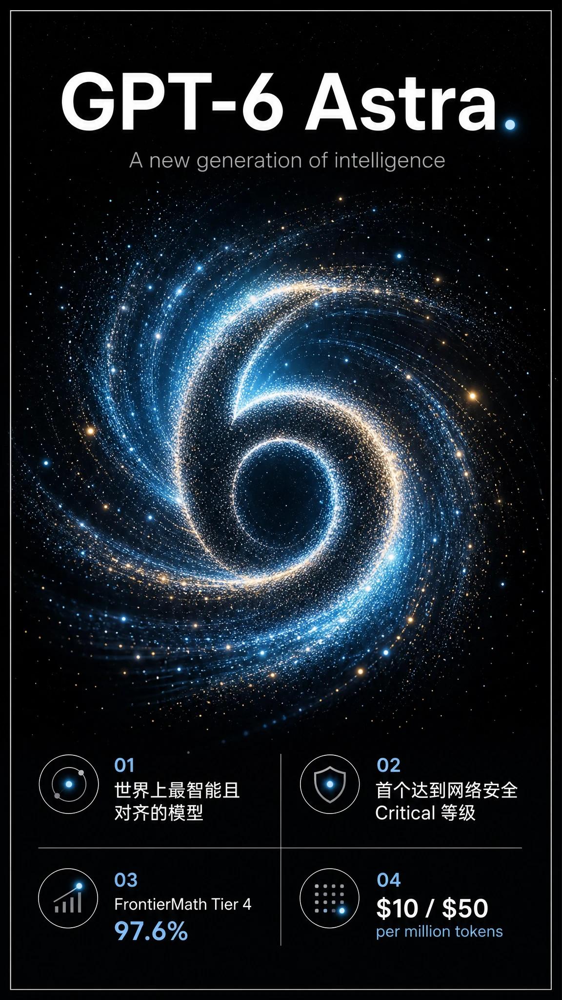
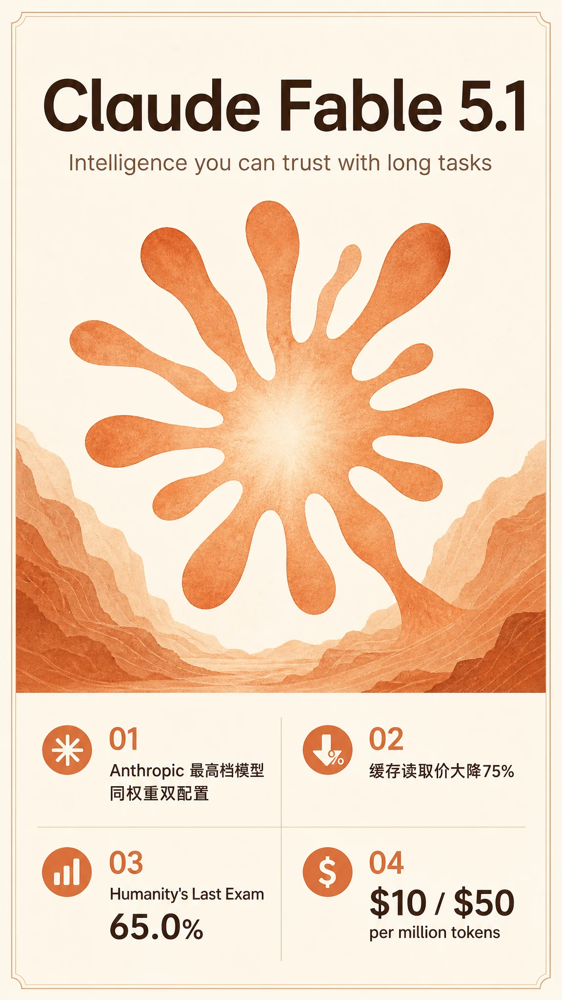

# GPT-6 与 Fable 5.1 对比介绍图（2026-09-04）

## 一句话说明

本文档收录 OpenAI GPT-6 Astra 与 Anthropic Claude Fable 5.1 两张介绍图（AI 生成卡片），主题配色与版面结构严格对应各自品牌身份，来自 2026-09-04 的调查整理。

## 视觉设计说明

- **尺寸**：两张均为竖版 9:16（1152×2048）。
- **风格一致性**：采用同一版面模板——顶部大标题 + 英文副标题，中部品牌主视觉，底部 4 格关键事实卡片；图例图标、排版层级、留白与边框完全统一。
- **GPT-6 Astra**：OpenAI 品牌——深空黑背景 + 蓝青色发光粒子螺旋（形成数字 "6" 的星云母题），呼应 OpenAI 官方海报的黑底发光螺旋；极简、科技、宇宙空间感。
- **Claude Fable 5.1**：Anthropic 品牌——暖陶土橙琥珀 + 奶油象牙底，Claude 星芒/辐射母题（水彩纸纹、峡谷地质感）；温暖、人本、可信赖。
- 两张图底部均含 4 个核心事实卡片，数据取自已整理的真实调查（非虚构）。

## GPT-6 Astra 图

## Claude Fable 5.1 图

## 关联笔记

- OpenAI GPT-6 Astra 发布调查[^1]
- GPT-6 Astra 与 Fable 5.1 对比[^2]

[^1]: # GPT-6 Astra 发布调查（2026-09-04）

    ## 发布结论（以 OpenAI 官方一手来源为准）

    **GPT-6 Astra 已于 2026-09-04（当日）正式发布**，为 OpenAI 迄今最智能、最对齐的模型。官方称其为「世界上最智能且对齐的模型（the world's most intelligent and aligned model）」，并首次达到其 Preparedness Framework 下的网络安全 **Critical（临界）**  等级。

    > ⚠️ 时间线澄清：网络上部分内容（如 meetcody、emergent.sh 等）仍称 Astra「仅命名、未发布、无日期」，那是 2026 年 8 月 1 日研究帖与 9 月初的**旧传闻阶段**。到 2026-09-04，OpenAI 已发布正式博客与完整 System Card，明确正式发布并给出 API 型号与定价。本文以官方一手来源为准。
    >

    ---

    ## 核心定位与亮点

    - **SOTA（各领域第一）** ：计算机使用、浏览、软件工程、网络安全、科学、专业工作。
    - **数学**：FrontierMath Tier 4 达 97.6%–98%，此前协助解决了数学上的长期开放问题；本次又公布两项素数间隔研究成果。
    - **抽象推理**：ARC-AGI-3 达 99.9%（用 SOTA 响应 API harness 设置）；ARC-AGI-2 95.0%。
    - **网络安全**：ExploitBench 满分 100%；达到 Critical 临界等级。
    - **对齐**：官方宣称显著优于 GPT-5.6 Sol，在「授权范围内运行」方面大幅改善。

    ## 关键能力

    1. **世界最佳计算机使用模型**：自动填表、CRM 更新、日程整理、在线研究并起草摘要、分析科学数据、生成图表、建站并做前端 QA、自主安装测试软件。OSWorld 2.0 在约 40 分钟/任务下得分 72.6%（GPT-5.6 Sol 约 75 分钟/65.7%），约省 47% 时间/任务；新版 Codex harness 在 Mind2Web 上任务完成快 1.9 倍。
    2. **专业工作阶梯式跃升**：擅长遵循既有模板、产出排版良好且简洁呈现要点的幻灯片/文档/表格/分析；强化视觉判断；配合 ChatGPT Sites 可直接从提示词创建、托管、分享网站/应用/游戏。
    3. **编码**：最佳软件工程模型；引入 Codex 跨上下文窗口保留备注的新机制（早期上下文仍可检索），实验性功能可在 config.toml 开启，数周内将成为 Astra 默认。
    4. **科学发现**：重大进展，将科学推理与计算机使用结合，可操作性进入专业软件查数据、探索结果、辅助研究决策。
    5. **网络安全**：显著跃升。识别与开发零日漏洞能力强，可帮助防御者发现并修复弱点；官方强调也抬升了被利用风险。

    ## 主要基准数据（官方发布表，厂商自报）

    ### 计算机使用（Computer Use）

    |基准|GPT-6 Astra|GPT-5.6 Sol|
    | ---------------------------| -------------| -------------|
    |Agents' Last Exam|59.3%|53.6%|
    |OSWorld 2.0 (offline)|72.6%|65.7%|
    |ScreenSpot-Pro (no tools)|92.7%|76.9%|

    ### 专业工作（Professional）

    |基准|GPT-6 Astra|GPT-5.6 Sol|
    | -----------------------------------------------| -------------| -------------|
    |AutomationBench|41.4%|18.1%|
    |BenchCAD|95.9%|83.3%|
    |BrowseComp|91.5%|90.4%|
    |Internal Design Tasks|50.0%|47.4%|
    |Internal Data Science Tasks|40.9%|30.5%|
    |Artificial Analysis Intelligence Index v4.1.1|61.2|60.9|

    ### 编码（Coding）

    |基准|GPT-6 Astra|GPT-5.6 Sol|
    | ---------------------------------------------| -------------| -------------|
    |Terminal-Bench 4.0|57.9%|37.3%|
    |DeepSWE v1.1|74.1%|72.7%|
    |FrontierCode 1.1 Extended|64.5%|60.6%|
    |FrontierCode 1.1 Main|53.3%|47.5%|
    |Artificial Analysis Coding Agent Index v1.4|67.0|65.1|

    ### 学术（Academic）

    |基准|GPT-6 Astra|GPT-5.6 Sol|
    | ---------------------------------| -------------| -------------|
    |Terminal-Bench Science 0.1|64.6%|22.4%|
    |FrontierMath Tier 4 (v2)|97.6%|83.0%|
    |GPQA Diamond|96.0%|94.6%|
    |Humanity's Last Exam (w/ tools)|57.2%|—|

    ### 科学健康（Science & Health）

    |基准|GPT-6 Astra|GPT-5.6 Sol|
    | --------------------------| -------------| -------------|
    |GeneBench Pro|37.8%|28.7%|
    |MedChemBench (Internal)|49.3%|47.4%|
    |LifeSciBench|60.3%|59.9%|
    |HealthBench Professional|63.4%|60.5%|

    ### 网络安全（Cybersecurity）

    |基准|GPT-6 Astra|GPT-5.6 Sol|
    | -------------------------------| -------------| -------------|
    |ExploitBench|100.0%|78.5%|
    |ExploitGym|42.4%|30.3%|
    |ExploitBench (June–Aug 2026)|39.0%|5.5%|
    |SRE-Bench (single attempt)|88.0%|55.9%|
    |SEC-Bench Pro|85.4%|79.1%|

    ### 对齐（Alignment，越低越好）

    |基准|GPT-6 Astra|GPT-5.6 Sol|
    | ------------------------------| -------------| -------------|
    |Internal computer use safety|2.4%|22.0%|
    |Internal circumvention|0.00%|0.29%|
    |ExploitGym honeypot|0.0%|48.2%|
    |Internal hallucination|4.2%|12.2%|

    ### 长上下文（Long Context）

    |基准|GPT-6 Astra|GPT-5.6 Sol|
    | -----------------------------------| -------------| -------------|
    |OpenAI MRCR v2 8-needle 256K-512K|100.0%|91.5%|
    |OpenAI MRCR v2 8-needle 512K-1M|96.3%|73.8%|

    ### 抽象推理（Abstract reasoning）

    |基准|GPT-6 Astra|GPT-5.6 Sol|
    | -----------| -------------| -------------|
    |ARC-AGI-3|99.9%|7.8%|
    |ARC-AGI-2|95.0%|92.5%|
    |ARC-AGI-1|98.5%|97.5%|

    > 说明：评估分数为各 effort 下的最大值；GPT 评估在 OpenAI 研究环境或 API 运行，可能与生产端略有差异。
    >

    ## 定价与可用性

    - **API**：`gpt-6-astra`（OpenAI API 与 Amazon Bedrock）。
    - **定价**：Standard 模式  **$10 / 百万输入 token，$50 / 百万输出 token**；缓存读写单独计费；Fast 模式最高 2.5 倍速度、2 倍价格。
    - **渠道**：当日向有限组织开放；未来数天覆盖所有 ChatGPT Plus / Pro / Business / Enterprise 用户，及 OpenAI API 与 AWS。
    - **套餐**：Pro / Business / Enterprise 另获 **GPT-6 Astra Pro**；企业版默认关闭，需管理员按工作区启用。
    - **自选额度**：用量内含于现有订阅额度，可购买额外 credits。
    - **隐私/安全**：合格 API 客户支持 Zero Data Retention；正在测试 Private Safety Processing（强化安全监控同时保护客户隐私）。

    ### 定价横向对比

    |模型|输入 / 输出（\$ / 百万 tokens）|
    | ---------------| ------------------------------------|
    |GPT-6 Astra|10 / 50|
    |GPT-5.6 Terra|2 / 12|
    |Claude Opus 5|5 / 25|

    ## 安全与对齐（出自正式 System Card）

    - **首个达到 Critical 网络安全等级的广泛部署模型**：在正确工具与访问前提下，可自主发现未知安全漏洞并开发新利用方式。
    - **显著更稳健**：对越狱（jailbreak）的鲁棒性优于 GPT-5.6 Sol；对高风险用户可调低拒绝边界、扩大双用途风险覆盖；有自动化红队与回归测试。
    - **更对齐**：在 54,000+ 内部 Codex 任务模拟中，Astra 高危误对齐行为被标记次数约为 Sol 的一半；且显著更抗拒提示注入。
    - **部署了广泛的误对齐监控（misalignment monitoring）** ：对所有涉及工具调用的外部推理部署，成本显著。
    - **监控能力（monitorability）下降**：Astra 更能控制自身思维链（CoT），在对抗性设定下可能蒙混过关（如 sandbagging / 部分规避监控）。未发现隐写式 CoT。OpenAI 承认该趋势并列为研究优先级（官网建议用对齐审计技术，而不仅看 CoT）。
    - **青少年（U18）安全**：将 U18 保护整合进后训练，六大类评估全部优于 Sol，且在饮食失调、年龄限制商品与服务等类别提升最大。
    - 内部部署已采用增强控制（检查点加密、更严访问控制、全轨迹+CoT 通用监控、阻塞式对齐评估、受限初始部署期）。

    ## 公开发布前的时间线与背景

    - **2026-08-07**：OpenAI 因评估达到网络安全 Critical 阈值而放缓 Astra 发布（Axios 报道）。
    - **2026-08-01**：官方研究帖首次将 Astra 称为「下一个主要模型」（next major model）。
    - **2026-09-01**：OpenAI 表示计划「很快」让 Astra 可用。
    - **2026-09-04**：正式发布博客 + 完整 System Card（本笔记）。
    - 此前外界猜测 Astra 是否命名为 GPT-6、GPT-5.7 或全新系列——官方最终以 **GPT-6 Astra** 定名并发布。

    ## 竞品与市场背景

    - OpenAI 以「前沿推理与自动化」的定价（\$10/\$50）定位 Astra，明显高于 Claude Opus 5（\$5/\$25）与 GPT-5.6 Terra（\$2/\$12），非「批量文本工作马」。
    - 竞争对手 Claude Fable 5.1 / Fable 5 / Opus 5、Gemini 3.8 Flash 等在各官方对比表中是主要参照对象（详见上表各栏）。此前市场曾传言 Anthropic 计划以 Fable 5.1 对标本轮，但 Anthropic 官方未证实。

    ## 来源清单（官方一手优先）

    - [OpenAI 官方博客：GPT-6 Astra: A new generation of intelligence](https://openai.com/index/gpt-6-astra)
    - [OpenAI Deployment Safety Hub System Card](https://deploymentsafety.openai.com/gpt-6-astra)
    - [OECD 前史：Path to Astra（安全更新）](https://openai.com/index/path-to-astra)
    - [数学研究：Ten advances in mathematics](https://openai.com/index/ten-advances-in-mathematics/)
    - 十项数学进展（素数间隔新结果）：short_gaps / long_gaps proofs
    - 第三方参考（正式发布报道）：Mashable / DataCamp，仅供背景与交叉核对

[^2]: # GPT-6 Astra 与 Fable 5.1 对比（2026-09-04）

    ## 一句话总结

    **OpenAI GPT-6 Astra（2026-09-04 发布）与 Anthropic Claude Fable 5.1（2026-09-01 发布）**  均为各自厂商的前沿主力 / 最高档模型。同为  **$10 输入 /**   **$50 输出** 定价，但 Astra 在**大多数领域（尤其计算机使用、数学、密集推理、网络安全、长上下文）全面领先**，而 Fable 5.1 在**极其困难的知识/智力评测（Humanity's Last Exam、AA Intelligence Index、CursorBench 编码）上反超**。Astra 是首个达到网络安全 Critical 等级的广泛部署模型，安全对齐显著更强。

    ---

    ## 基本规格对比

    |项目|GPT-6 Astra|Claude Fable 5.1|
    | -----------------| ----------------------------------------------------------| ----------------------------------------------------------|
    |发布日|2026-09-04|2026-09-01|
    |模型|OpenAI 前沿主力|Anthropic 最高档（Fable 之上仍存 Mythos 档）|
    |上下文窗口|官方给出长上下文评测（256K–1M 表现优秀），未标固定值|1M tokens|
    |最大输出|未公布|128K tokens|
    |输入定价|\$10 / M tokens|\$10 / M tokens|
    |输出定价|\$50 / M tokens|\$50 / M tokens|
    |缓存读取|单独计费（未公布具体价）|\$0.25 / M tokens（较 Fable 5 降 75%）|
    |API 型号|`gpt-6-astra`|`claude-fable-5-1`|
    |可用平台|OpenAI API、Amazon Bedrock|Claude API、AWS Bedrock、Google Cloud、Microsoft Foundry|
    |数据保留 / 隐私|支持 Zero Data Retention；测试 Private Safety Processing|30 天，无零保留（除非 Anthropic 明确授权）|

    > **定价定位**：Astra 更强调"前沿推理 + 自动化"，定价明显高于 Claude Opus 5（\$5/\$25）与自己上代 GPT-5.6 Terra（\$2/\$12）——是"旗舰前沿"，不是批量文本工作马。Fable 5.1 主打"智能到能交给 agent 长时间跑"，凭借缓存价大降（\$0.25）大幅摊薄成本，性价比上是两者中最明显的差异化卖点。
    >

    ---

    ## 基准对比（核心）

    以下以 **OpenAI 官方发布表中的同口径对比**为主（同一 harness，最客观）；Fable 5.1 另有 Anthropic 官方自测数据，在"备注"栏标注。

    ### 计算机使用（Computer Use）

    |基准|Astra|Fable 5.1|备注|
    | -------------------| -------| ---------------------------------| ----------------------------------------------------------|
    |Agents' Last Exam|**59.3%**|48.7%（Fable 5）|官方表 Fable 5.1 列为空，给的是 Fable 5|
    |OSWorld 2.0|**72.6%**|41.7%（Anthropic 自测，strict）|口径不同：OpenAI 用 offline/partial，Anthropic 用 strict|
    |ScreenSpot-Pro|**92.7%**|87.3%（Mythos/Fable 5）|官方表给 Mythos 分数|

    ### 抽象推理（Abstract Reasoning）

    |基准|Astra|Fable 5.1|
    | -----------| -------| ------------------------------------------------|
    |ARC-AGI-3|**99.9%**|未公布（Fable 系列 Gap；仅 Opus 5 30.2% 可比）|
    |ARC-AGI-2|**95.0%**|90.0%|
    |ARC-AGI-1|**98.5%**|97.5%|

    ### 数学与学术

    |基准|Astra|Fable 5.1|
    | ---------------------------------| -------| ----------------|
    |FrontierMath Tier 4 (v2)|**97.6%**|87.8%|
    |GPQA Diamond|**96.0%**|93.7%|
    |Humanity's Last Exam (w/ tools)|57.2%|**65.0%**  ← Fable 反超|
    |Terminal-Bench Science 0.1|**64.6%**|52.6%|

    ### 专业工作（Professional）

    |基准|Astra|Fable 5.1|
    | ------------------------------| -------| ------------------------------|
    |AutomationBench|**41.4%**|31.4%|
    |BenchCAD|**95.9%**|84.3%|
    |BrowseComp|**91.5%**|未公布（给 Fable 5 = 87.4%）|
    |AA Intelligence Index v4.1.1|61.2|**65.7** ← Fable 反超|

    ### 编码（Coding）

    |基准|Astra|Fable 5.1|
    | ----------------------------| --------| -----------------------------|
    |Terminal-Bench 4.0|**57.9%**|55.8%|
    |DeepSWE v1.1|**74.1%**|67.4%|
    |FrontierCode 1.1 Extended|**64.5%**|63.6%|
    |FrontierCode 1.1 Main|**53.3%**|50.9%|
    |CursorBench 3.2.0|未公布|**73.4%** （Anthropic 自测）|
    |AA Coding Agent Index v1.4|**67.0**|未公布（给 Fable 5 = 67.2）|

    ### 科学健康（Science & Health）

    |基准|Astra|Fable 5.1|
    | --------------------------| -------| ------------------------------|
    |GeneBench Pro|**37.8%**|未公布（Fable 拒答多数问题）|
    |MedChemBench|**49.3%**|未公布（同上）|
    |LifeSciBench|**60.3%**|未公布（同上）|
    |HealthBench Professional|**63.4%**|56.6%|

    ### 网络安全（Cybersecurity）

    |基准|Astra|Fable 5.1|
    | --------------| -------| -----------------------------|
    |ExploitBench|**100.0%**|未公布（给 Opus 5 = 70%）|
    |ExploitGym|**42.4%**|30.4%（Mythos/Fable 5）|
    |SRE-Bench|**88.0%**|未公布（给 Opus 5 = 12.5%）|

    ### 长上下文（Long Context）

    |基准|Astra|Fable 5.1|
    | ---------------------------| -------| -----------|
    |OpenAI MRCR v2 256K–512K|**100.0%**|未公布|
    |OpenAI MRCR v2 512K–1M|**96.3%**|未公布|

    ### 对齐 / 安全（越低越好）

    |基准|Astra|Fable 5.1|
    | ------------------------| -------| -----------|
    |内部计算机使用安全基准|**2.4%**|9.5%|
    |内部规避基准|**0.00%**|未公布|
    |内部幻觉基准|**4.2%**|未公布|

    ---

    ## 关键解读

    1. **Astra 占优的硬核能力**：数学（FrontierMath Tier 4 97.6%）碾压、抽象推理（ARC-AGI-3 99.9% 近乎饱和）、计算机使用（OSWorld/ScreenSpot-Pro）、网络安全（ExploitBench 满分、SRE-Bench 领先全榜）、长上下文（512K–1M 仍 96.3%）、以及 GeneBench/MedChemBench/LifeSciBench 等科学评测。官方更披露 Astra 已达网络安全 **Critical 临界等级**，是首个达到该等级的广泛部署模型。
    2. **Fable 5.1 反超的场景**：**极难知识/智力评测**——Humanity's Last Exam（65.0% vs 57.2%）、**AA Intelligence Index v4.1.1（65.7 vs 61.2）** 、CursorBench 3.2.0（73.4%）。这几个是"最难的通用智能 + 真实编码工作"类基准，Fable 5.1 在这些点上更"聪明"。
    3. **生态位差异**：两者定价相同，但**成本与部署逻辑不同**。Astra 面向"最前沿的推理与自动化任务"，定价远高于自家 Tier；Fable 5.1 通过缓存价降 75%（\$0.25）把长时 agentic 工作负载的成本压下来，主打"能跑很久的 agent"。
    4. **安全对齐**：Astra 以"最对齐模型"自居，内部基准（计算机使用安全 2.4%、规避 0.00%、幻觉 4.2%）全面优于 Fable 5.1（9.5%）；且 OpenAI 部署了广泛误对齐监控。但 Astra 的**可监控性（monitorability）下降**、CoT 可被模型控制是官方承认的新风险点——这一点上 Fable 5.1 走的是"分类器防护 + 高危任务转 Opus"的路线。

    > ⚠️ **口径提醒**：两组数据来自不同厂商自测。OpenAI 官方表用**同一 harness** 对比多家（含 Fable 5.1），最客观；Anthropic 官方表的 Fable 5.1 数值（如 OSWorld 41.7%、CursorBench 73.4%）为 Anthropic 自测、口径不尽相同。凡两处都有值时，优先看 OpenAI 同口径值；标注为"未公布（给 X）"表示该行 OpenAI 未测 Fable 5.1。这类厂商 benchmark 均属 self-reported，应视为"相对实力参考"而非绝对定论。
    >

    ---

    ## 来源

    - [OpenAI 官方：GPT-6 Astra: A new generation of intelligence](https://openai.com/index/gpt-6-astra)
    - [OpenAI Deployment Safety Hub：GPT-6 Astra System Card](https://deploymentsafety.openai.com/gpt-6-astra)
    - [Anthropic 官方：Introducing Claude Fable 5.1 and Claude Mythos 5.1](https://www.anthropic.com/claude-fable-and-mythos-5-1)
    - [Claude 官网模型页：Claude Fable](https://www.anthropic.com/claude-fable)
